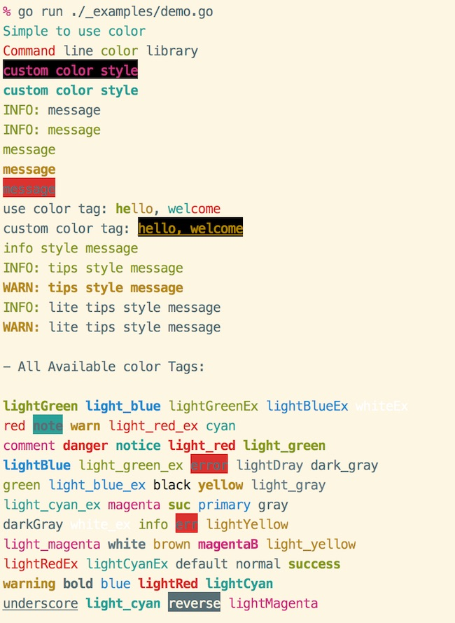

# cli color

Command line color library, written using golang

**[中文说明](README_cn.md)**

## Features

- Easy to use
- supports rich color output
- supports html tab-style color rendering
- compatible with Windows

## Install

- use dep

```bash
dep ensure -add gopkg.in/gookit/color.v1 // is recommended
// OR
dep ensure -add github.com/gookit/color
```

- go get

```bash
go get gopkg.in/gookit/color.v1 // is recommended
// OR
go get -u github.com/gookit/color
```

- git clone

```bash
git clone https://github.com/gookit/color
```

## Godoc

- [godoc for gopkg](https://godoc.org/gopkg.in/gookit/color.v1)
- [godoc for github](https://godoc.org/github.com/gookit/color)

## Quick start

```bash
import "gopkg.in/gookit/color.v1" // is recommended
// or
import "github.com/gookit/color"
```

```go
package main

import (
    "github.com/gookit/color"
)

func main() {
	// simple usage
	color.FgCyan.Printf("Simple to use %s\n", "color")

    // use like func
    red := color.FgRed.Render
    green := color.FgGreen.Render
    fmt.Printf("%s line %s library\n", red("Command"), green("color"))

	// custom color
	color.New(color.FgWhite, color.BgBlack).Println("custom color style")

	// can also:
	color.Style{color.FgCyan, color.OpBold}.Println("custom color style")
	
	// use style tag
	color.Print("<suc>he</><comment>llo</>, <cyan>wel</><red>come</>\n")

	// set a style tag
	color.Tag("info").Println("info style text")

	// use info style tips
	color.Tips("info").Print("tips style text")

	// use info style blocked tips
	color.LiteTips("info").Print("blocked tips style text")
}
```

run demo: `go run ./_examples/app.go`

### Color output display



### More usage

#### Basic color functions

> support on windows `cmd.exe`

- `color.Bold(args ...interface{})`
- `color.Black(args ...interface{})`
- `color.White(args ...interface{})`
- `color.Gray(args ...interface{})`
- `color.Red(args ...interface{})`
- `color.Green(args ...interface{})`
- `color.Yellow(args ...interface{})`
- `color.Blue(args ...interface{})`
- `color.Magenta(args ...interface{})`
- `color.Cyan(args ...interface{})`

```go
color.Bold("bold message")
color.Yellow("yellow message")
```

#### Extra style functions 

> support on windows `cmd.exe`

- `color.Info(args ...interface{})`
- `color.Note(args ...interface{})`
- `color.Light(args ...interface{})`
- `color.Error(args ...interface{})`
- `color.Danger(args ...interface{})`
- `color.Notice(args ...interface{})`
- `color.Success(args ...interface{})`
- `color.Comment(args ...interface{})`
- `color.Primary(args ...interface{})`
- `color.Warning(args ...interface{})`
- `color.Question(args ...interface{})`
- `color.Secondary(args ...interface{})`

```go
color.Info("Info message")
color.Success("Success message")
```

#### Use like html tag

> **not** support on windows `cmd.exe`

```go
// use style tag
color.Print("<suc>he</><comment>llo</>, <cyan>wel</><red>come</>")
color.Println("<suc>hello</>")
color.Println("<error>hello</>")
color.Println("<warning>hello</>")

// custom color attributes
color.Print("<fg=yellow;bg=black;op=underscore;>hello, welcome</>\n")
```

- `color.Tag`

```go
// set a style tag
color.Tag("info").Print("info style text")
color.Tag("info").Printf("%s style text", "info")
color.Tag("info").Println("info style text")
```

### Internal color tags

```text
// Some internal defined style tags
// usage: <tag>content text</>

// basic tags
- red
- blue
- cyan
- black
- green
- brown
- white
- default  // no color
- normal// no color
- yellow  
- magenta 

// alert tags like bootstrap's alert
- suc // same "green" and "bold"
- success 
- info // same "green"
- comment  // same "brown"
- note 
- notice  
- warn
- warning 
- primary 
- danger // same "red"
- err 
- error

// more tags
- lightRed
- light_red
- lightGreen
- light_green
- lightBlue 
- light_blue
- lightCyan
- light_cyan
- lightDray
- light_gray
- gray
- darkGray
- dark_gray
- lightYellow
- light_yellow  
- lightMagenta  
- light_magenta 

// extra
- lightRedEx
- light_red_ex
- lightGreenEx
- light_green_ex 
- lightBlueEx
- light_blue_ex  
- lightCyanEx
- light_cyan_ex  
- whiteEx
- white_ex

// option
- bold
- underscore 
- reverse
```

## Ref

- `issue9/term` https://github.com/issue9/term
- `beego/bee` https://github.com/beego/bee
- `inhere/console` https://github/inhere/php-console
- [ANSI escape code](https://en.wikipedia.org/wiki/ANSI_escape_code)

## License

MIT
