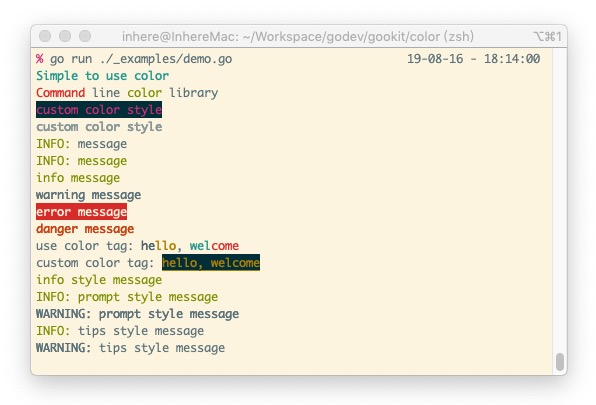
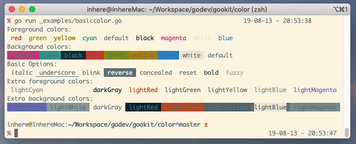
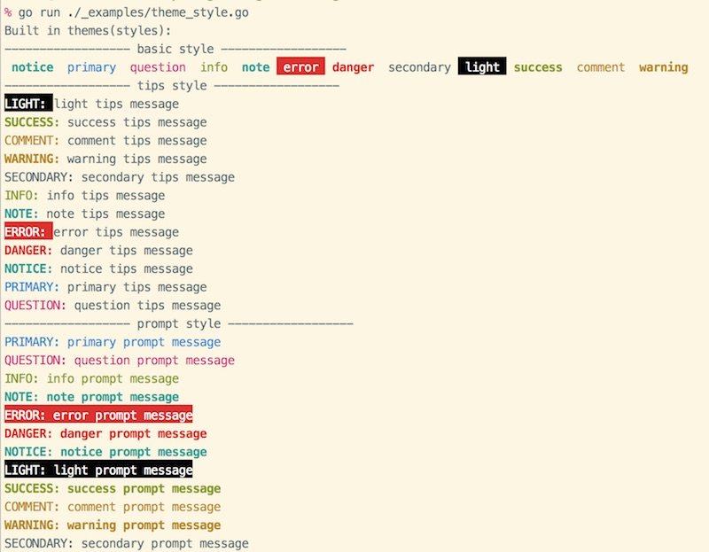
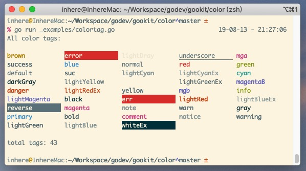

# cli color

[](https://godoc.org/github.com/gookit/color)
[](https://travis-ci.org/gookit/color)
[](https://coveralls.io/github/gookit/color?branch=master)
[](https://goreportcard.com/report/github.com/gookit/color)

Command line color library. rich color rendering output, universal API method, compatible with Windows system

**[中文说明](README_cn.md)**

## Features

- Simple to use
- Supports rich color output
- Generic API method: `Print` `Printf` `Println` `Sprint` `Sprintf`
- Supports html tab-style color rendering. like: `<green>message</>`
- Compatible with Windows system environment
- Basic color: `Bold` `Black` `White` `Gray` `Red` `Green` `Yellow` `Blue` `Magenta` `Cyan`
- Extra style: `Info` `Note` `Light` `Error` `Danger` `Notice` `Success` `Comment` `Primary` `Warning` `Question` `Secondary`

## Install

- use dep

```bash
dep ensure -add gopkg.in/gookit/color.v1 // is recommended
// OR
dep ensure -add github.com/gookit/color
```

- go get

```bash
go get gopkg.in/gookit/color.v1 // is recommended
// OR
go get -u github.com/gookit/color
```

## Godoc

- [godoc for gopkg](https://godoc.org/gopkg.in/gookit/color.v1)
- [godoc for github](https://godoc.org/github.com/gookit/color)

## Quick start

```bash
import "gopkg.in/gookit/color.v1" // is recommended
// or
import "github.com/gookit/color"
```

```go
package main

import (
	"fmt"
	"github.com/gookit/color"
)

func main() {
	// simple usage
	color.Cyan.Printf("Simple to use %s\n", "color")

	// use like func
	red := color.FgRed.Render
	green := color.FgGreen.Render
	fmt.Printf("%s line %s library\n", red("Command"), green("color"))

	// custom color
	color.New(color.FgWhite, color.BgBlack).Println("custom color style")

	// can also:
	color.Style{color.FgCyan, color.OpBold}.Println("custom color style")
	
	// internal theme/style:
	color.Info.Tips("message")
	color.Info.Prompt("message")
	color.Info.Println("message")
	color.Warn.Println("message")
	color.Error.Println("message")
	
	// use style tag
	color.Print("<suc>he</><comment>llo</>, <cyan>wel</><red>come</>\n")

	// set a style tag
	color.Tag("info").Println("info style text")

	// use info style tips
	color.Tips("info").Print("tips style text")

	// use info style blocked tips
	color.LiteTips("info").Print("blocked tips style text")
}
```

> run demo: `go run ./_examples/app.go`



## More usage

### Basic color

> support on windows `cmd.exe`

- `color.Bold`
- `color.Black`
- `color.White`
- `color.Gray`
- `color.Red`
- `color.Green`
- `color.Yellow`
- `color.Blue`
- `color.Magenta`
- `color.Cyan`

```go
color.Bold.Println("bold message")
color.Yellow.Println("yellow message")
```

> run demo: `go run ./_examples/basiccolor.go`



### Extra styles 

> support on windows `cmd.exe`

- `color.Info`
- `color.Note`
- `color.Light`
- `color.Error`
- `color.Danger`
- `color.Notice`
- `color.Success`
- `color.Comment`
- `color.Primary`
- `color.Warning`
- `color.Question`
- `color.Secondary`

```go
color.Info.Print("Info message")
color.Success.Print("Success message")
```

> run demo: `go run ./_examples/theme_style.go`



### Use like html tag

> **not** support on windows `cmd.exe`

```go
// use style tag
color.Print("<suc>he</><comment>llo</>, <cyan>wel</><red>come</>")
color.Println("<suc>hello</>")
color.Println("<error>hello</>")
color.Println("<warning>hello</>")

// custom color attributes
color.Print("<fg=yellow;bg=black;op=underscore;>hello, welcome</>\n")
```

- `color.Tag`

```go
// set a style tag
color.Tag("info").Print("info style text")
color.Tag("info").Printf("%s style text", "info")
color.Tag("info").Println("info style text")
```

> run demo: `go run ./_examples/colortag.go`



## Refer

- `issue9/term` https://github.com/issue9/term
- `beego/bee` https://github.com/beego/bee
- `inhere/console` https://github/inhere/php-console
- [ANSI escape code](https://en.wikipedia.org/wiki/ANSI_escape_code)

## License

**MIT**
